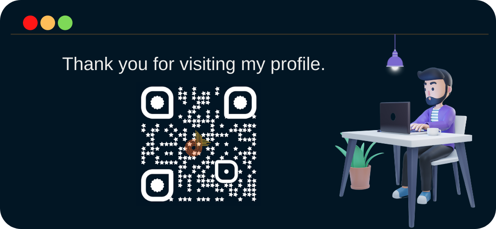

<h1 align="center"> नमस्ते (Namaste) & Hello World

<br/>
🙏
</h1>

```javascript
const dushyant = {
  pronouns: () => "He" | "Him",
  role: () => "Full-stack Developer",
  language_spoken: () => ["en-US, hi-IN", "gu-IN"],
  interested_about: () => [
    "Web Development",
    "Mobile Development",
    "AI/ML",
    "Blockchain",
  ],
  greet: () =>
    "I'm glad you stopped by; I hope you find some of my work interesting.",
};
const me = dushyant;
console.log(me.greet());

//I know ; is not required anymore,
//but that hide and sike champion has given me nightmares in the past.
```
---

  <h4 align="center">My Github Stats</h4>
 
  <p align="center">
      </a>
      <a target="_blank" href="https://streak-stats.herokuapp.com?user=dushyantDevTips&theme=highcontrast&hide_border=true&date_format=M%20j%5B%2C%20Y%5D&background=0A0C10&stroke=7E3ACD&fire=7E3ACD&ring=7E3ACD&currStreakLabel=7E3ACD">
      
    </a>
    <br/>
    <a target="_blank" href="https://github-readme-stats.vercel.app/api?username=dushyantDevTips&show_icons=true&include_all_commits=true&custom_title=Profile%20Stats&count_private=true&theme=midnight-purple&bg_color=0A0C10&hide_border=true">
      
    </a>
    <a target="_blank" href="https://github-readme-stats.vercel.app/api/top-langs/?username=dushyantDevTips&layout=compact&theme=midnight-purple&hide=html&hide_border=true&bg_color=0A0C10">
      
    <br/>
    <a target="_blank" href="https://contribution-graph.herokuapp.com/graph">
      
    </a> 
   
    
  </p>
  <br/>
  <br/>

---

<h4 align="center">WakaTime Data Analysis.</h4>
<!-- WakaTime -->
<!--START_SECTION:waka-->

```text
From: 22 February 2022 - To: 01 March 2022

Other        2 hrs 15 mins   █████████████████████▒░░░   85.21 %
```

<!--END_SECTION:waka-->

<br/>
<br/>
<br/>

---

<h4 align="center">Tech I work with.</h4>

<table>
  <tr>
    <th>
      <h4>Front-end</h4>
    </th>
    <th>
      <h4>Back-end</h4>
    </th>
    <th>
      <h4>DBA</h4>
    </th>
    <th>
      <h4>DevOps</h4>
    </th>
  </tr>
  <tr>
    <!-- Front-end -->
    <td>
        <!-- HTML -->
        <a href="https://developer.mozilla.org/en-US/docs/Glossary/HTML5" target="_blank">
        </a>
        <!-- Css -->
        <a href="https://developer.mozilla.org/en-US/docs/Web/CSS" target="_blank">
        </a>
        <!-- Js -->
        <a href="https://www.javascript.com/" target="_blank">
        </a>
        <!-- sass -->
        <a href="https://sass-lang.com/" target="_blank">
        </a>
        <!-- Bootstrap  -->
        <a href="https://getbootstrap.com/" target="_blank">
        </a>
        <!-- react Js  -->
        <a href="https://reactjs.org/" target="_blank">
        </a>
        <!--Material ui -->
        <a href="https://mui.com/" target="_blank">
        </a>
        <!-- vue Js -->
        <a href="https://vuejs.org/" target="_blank">
        </a>
        <!--vuetify -->
        <a href="https://vuetifyjs.com/en/" target="_blank">
        </a>
        <!-- Webpack -->
        <a href="https://webpack.js.org/" target="_blank">
        </a>
    </td>
    <!-- Back-end -->
    <td>
      <!-- NodeJs -->
      <a href="https://nodejs.org/en/" target="_blank">
      </a>
      <!-- Express  -->
      <a href="https://expressjs.com/" target="_blank">
      </a>
      <!-- php  -->
      <a href="https://www.php.net/" target="_blank">
      </a>
      <!-- Laravel  -->
      <a href="https://laravel.com/" target="_blank">
      </a>
    </td>
    <!-- DBA -->
    <td>
      <!-- mysql -->
      <a href="https://www.mysql.com/" target="_blank">
      </a>
      <!-- PostgreSQL -->
      <a href="https://www.postgresql.org/ " target="_blank">
      </a>
        <!-- MongoDB  -->
      <a href="https://www.mongodb.com/" target="_blank">
      </a>
      <!-- Sequelize  -->
      <a href="https://sequelize.org/" target="_blank">
      </a>
      <!-- Prisma -->
      <a href="https://www.prisma.io/ " target="_blank">
      </a>
    </td>
    <!-- DevOps -->
    <td>
      <!-- AWS  -->
      <a href="https://aws.amazon.com/" target="_blank">
      </a>
      <!-- gcp -->
      <a href="https://cloud.google.com/" target="_blank">
      </a>
      <!-- DigitalOcean -->
      <a href="https://m.do.co/c/f91b02103d21" target="_blank">
      </a>
      <!-- docker -->
      <a href="https://www.docker.com/" target="_blank">
      </a>
      <!-- Kubernetes -->
      <a href="https://kubernetes.io/" target="_blank">
      </a>
      <!-- GitHub Actions -->
      <a href="https://github.com/features/actions/" target="_blank">
      </a>
      <!-- Git  -->
      <a href="https://git-scm.com/" target="_blank">
      </a>
      <!-- Gitlab -->
      <a href="https://about.gitlab.com/" target="_blank">
      </a>
    </td>
  </tr>
</table>

<br/>
<br/>
<br/>

---

<h4 align="center">Tech I'm learning.</h4>
  <!-- tailwind css  -->
  <a href="https://tailwindcss.com/" target="_blank">
  </a>
  <!-- GO -->
  <a href="https://go.dev/" target="_blank">
  </a>
  <!-- TypeScript  -->
  <a href="https://www.typescriptlang.org/" target="_blank">
  </a>
  <!-- Jenkins -->
  <a href="https://www.jenkins.io/" target="_blank">
  </a>
  <!-- Terraform -->
  <a href="https://www.terraform.io/" target="_blank">
  </a>

<br/>
<br/>
<br/>

---

<h4 align="center">Software I use for development.</h4>
<!-- Pop_os -->
<a href="https://pop.system76.com/" target="_blank">
</a>

<!-- mac os-->
<a href="https://www.apple.com/macos" target="_blank">
</a>

<!-- Ubuntu-->
<a href="https://ubuntu.com/" target="_blank">
</a>
<!-- VS Code -->
<a href="https://code.visualstudio.com/" target="_blank">
</a>

<!-- Vim -->
<a href="https://www.vim.org/" target="_blank">
</a>

<!-- Hyper.js -->
<a href="https://hyper.is/" target="_blank">
</a>

<!-- Figma -->
<a href="https://www.figma.com/" target="_blank">
</a>

<!-- Canva -->
<a href="https://www.canva.com/" target="_blank">
</a>

<!-- Postman -->
<a href="https://www.postman.com/" target="_blank">
</a>

<!-- Thunder Client -->
<a href="https://www.thunderclient.com/ " target="_blank">
</a>

<!-- Jira  -->
<a href="https://www.atlassian.com/software/jira" target="_blank">
</a>

<!-- Notion -->
<a href="https://www.notion.so/" target="_blank">
</a>

<!-- Slack -->
<a href="https://slack.com/" target="_blank">
</a>

<br/>
<br/>
<br/>

---

<h4 align="center"> Best way to get in touch.</h4>

  <a target="_blank" href="https://www.linkedin.com/in/dushyantdevtips/" style="padding:5px">
  
  </a>

  <!-- Twitter -->
  <a target="_blank" href="https://twitter.com/dushyantDevTips" style="padding:5px">
  
  </a>

  <!-- Discord -->
  <a target="_blank" href="https://discordapp.com/users/655147188254408733" style="padding:5px">
  
  </a>

  <!-- Email -->
  <a target="_blank" href="mailto:dushyant@devtipsmedia.com" style="padding:5px">
  
  </a>

  <!-- Discussion -->
  <a href="https://github.com/dushyantDevTips/dushyantDevTips/discussions" style="padding:5px">
  
  </a>

<br/>
<br/>
<br/>

---

<!-- Art image -->


<a href="https://www.devtipsmedia.com" target="_blank"></a>
